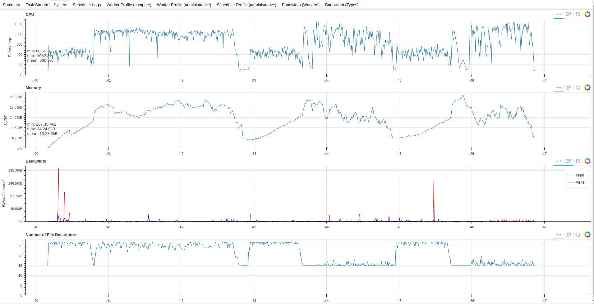

# Recup_Data

## Dask 
1. [Original dask report](Reports/dask_perf_report.html)
   
   
   Fig. Dask task stream from the html report
   
   
   Fig. Dask system performance from html report

2. [Yaml task-stream](Reports/task_stream.yaml)
3. [Yaml Dask configuration](Reports/distributed.yaml)
    
## Yappi
1. [Pstat view of the yappi report](Reports/yappi_pstat.prof)
   It call be visualized using `snakeViz`
   
   Fig. Yappi Pstat performance from html report of Snakeviz
   
3. [Callgrind view of the yappi report](Reports/yappi_callgrind.prof)
   It call be visualized using `kcachegring`
   
   Fig. Yappi CallGrind performance
   

## Darshan 
1. [Original darshan report](Reports/agueroud_python_id1845200-1845200_1-23-45607-10965031484157506122_1.darshan)
2. [HTML darshan report](Reports/agueroud_python_id1845200-1845200_1-23-45607-10965031484157506122_1_report.html)
   
   
   
   Fig. Darshan IOs the from html report

   
